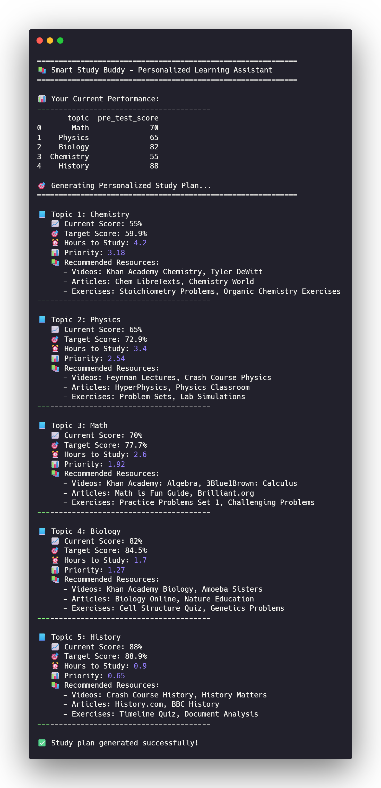

# 🎓 Smart Study Buddy

*Final project for the Building AI course*

---

## Summary

Smart Study Buddy is an AI-powered learning assistant that creates personalized study plans by analyzing student performance data, predicting exam outcomes, and recommending tailored resources. It helps students optimize their study time and improve academic performance through data-driven insights, making quality education more accessible to everyone.

---

## Background

### Problems This Solution Addresses

- **Inefficient studying** - Students waste valuable time reviewing topics they've already mastered while neglecting areas that need improvement
- **Exam anxiety** - Students lack clarity about their current preparation level and have no reliable way to predict their potential performance
- **Overwhelming choices** - With countless online resources available, students struggle to identify which materials will be most beneficial
- **One-size-fits-all education** - Traditional learning methods ignore individual learning styles, paces, and personal circumstances

### Motivation & Importance

This problem affects **millions of students worldwide**. According to educational research:
- Personalized learning can improve retention by up to **60%**
- **65%** of students report feeling overwhelmed by exam preparation
- Students who use adaptive learning tools show **30%** better performance on average

---

## How is it used?

### User Flow

1. **Student logs in** and inputs their subjects, topics, and upcoming exams
2. **System analyzes** past performance (grades, study hours, difficulty ratings)
3. **AI generates** a personalized study schedule with prioritized topics
4. **Student studies** according to the plan and logs daily progress
5. **AI adjusts** recommendations based on real-time performance data

### Who Uses It

| User Type | Description | Needs |
|-----------|-------------|-------|
| **High school students** | Preparing for final exams | Clear priorities, time management |
| **College students** | Managing multiple courses | Efficient resource allocation |
| **Self-learners** | Studying new subjects | Guidance, structure, tracking |
| **Teachers** | Providing personalized guidance | Student insights, interventions |

### 📸 Dashboard Preview



*The Smart Study Buddy dashboard showing personalized study recommendations*


### Implementation Code

```python
"""
Smart Study Buddy - Main AI Module
Building AI Course Project
"""

import pandas as pd
import numpy as np
from sklearn.linear_model import LinearRegression
import json
import os

class SmartStudyBuddy:
    """Main AI-powered study assistant class"""
    
    def __init__(self, student_id, data_path='data/'):
        self.student_id = student_id
        self.data_path = data_path
        self.student_data = self.load_student_data()
        self.resources = self.load_resources()
        self.study_plan = []
        
    def load_student_data(self):
        """Load student performance data"""
        try:
            df = pd.read_csv(f'{self.data_path}student_data.csv')
            return df[df['student_id'] == self.student_id]
        except FileNotFoundError:
            return self.create_sample_data()
    
    def create_sample_data(self):
        """Generate sample student data"""
        return pd.DataFrame({
            'topic': ['Math', 'Physics', 'Biology', 'Chemistry', 'History'],
            'study_hours': [5, 3, 4, 6, 2],
            'pre_test_score': [70, 65, 82, 55, 88],
            'post_test_score': [85, 72, 88, 62, 90],
            'difficulty_rating': [3, 4, 2, 5, 1]
        })
    
    def load_resources(self):
        """Load available study resources"""
        return {
            'Math': {
                'videos': ['Khan Academy: Algebra', '3Blue1Brown: Calculus'],
                'articles': ['Math is Fun Guide', 'Brilliant.org'],
                'exercises': ['Practice Problems', 'Challenging Problems']
            },
            'Physics': {
                'videos': ['Feynman Lectures', 'Crash Course Physics'],
                'articles': ['HyperPhysics', 'Physics Classroom'],
                'exercises': ['Problem Sets', 'Lab Simulations']
            },
            'Biology': {
                'videos': ['Khan Academy Biology', 'Amoeba Sisters'],
                'articles': ['Biology Online', 'Nature Education'],
                'exercises': ['Cell Structure Quiz', 'Genetics Problems']
            }
        }
    
    def generate_study_plan(self, topics=None, available_hours=20):
        """Generate personalized study plan"""
        if topics is None:
            topics = self.student_data['topic'].tolist()
        
        study_plan = []
        student_topics = self.student_data[self.student_data['topic'].isin(topics)]
        
        for _, row in student_topics.iterrows():
            difficulty = row['difficulty_rating']
            current_score = row['pre_test_score']
            priority = (difficulty * 0.6) + ((100 - current_score) / 100 * 0.4)
            
            improvement = row.get('post_test_score', current_score + 10) - current_score
            learning_rate = improvement / row['study_hours'] if row['study_hours'] > 0 else 2
            target_improvement = max(0, 90 - current_score)
            optimal_hours = target_improvement / learning_rate if learning_rate > 0 else 2
            
            total_priority = sum(student_topics['difficulty_rating'])
            allocated_time = min(optimal_hours, available_hours * priority / total_priority)
            
            recommendations = self.resources.get(row['topic'], {
                'videos': ['General resources'],
                'articles': ['General articles'],
                'exercises': ['Practice exercises']
            })
            
            study_plan.append({
                'topic': row['topic'],
                'current_score': current_score,
                'target_score': min(100, current_score + (allocated_time * learning_rate)),
                'hours': round(allocated_time, 1),
                'priority': round(priority, 2),
                'difficulty': difficulty,
                'resources': recommendations
            })
        
        study_plan = sorted(study_plan, key=lambda x: x['priority'], reverse=True)
        return study_plan
    
    def predict_performance(self, topic, hours_studied):
        """Predict test score using learning rate"""
        topic_data = self.student_data[self.student_data['topic'] == topic]
        
        if len(topic_data) == 0:
            return None
        
        row = topic_data.iloc[0]
        current_score = row['pre_test_score']
        improvement = row.get('post_test_score', current_score + 10) - current_score
        learning_rate = improvement / row['study_hours'] if row['study_hours'] > 0 else 2
        
        predicted_score = min(100, current_score + (hours_studied * learning_rate))
        return round(predicted_score, 1)

def main():
    """Main function - demonstrates Smart Study Buddy usage"""
    print("=" * 60)
    print("📚 Smart Study Buddy - Personalized Learning Assistant")
    print("=" * 60)
    
    buddy = SmartStudyBuddy(student_id="STU001")
    
    print("\n📊 Your Current Performance:")
    print("-" * 40)
    print(buddy.student_data[['topic', 'pre_test_score']])
    
    print("\n🎯 Generating Personalized Study Plan...")
    print("=" * 60)
    
    study_plan = buddy.generate_study_plan(available_hours=20)
    
    for idx, session in enumerate(study_plan, 1):
        print(f"\n📘 Topic {idx}: {session['topic']}")
        print(f"   📈 Current Score: {session['current_score']}%")
        print(f"   🎯 Target Score: {session['target_score']:.1f}%")
        print(f"   ⏰ Hours to Study: {session['hours']}")
        print(f"   📊 Priority: {session['priority']:.2f}")
        
        if session['resources']:
            print("   📚 Recommended Resources:")
            for resource_type, resources in session['resources'].items():
                if resources:
                    print(f"      - {resource_type.capitalize()}: {', '.join(resources[:2])}")
        print("-" * 40)
    
    print("\n✅ Study plan generated successfully!")

if __name__ == "__main__":
    main()
